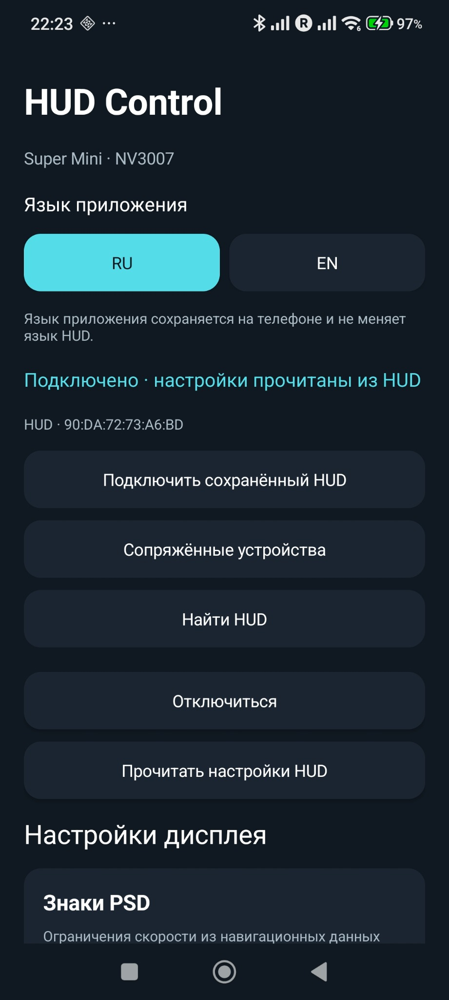
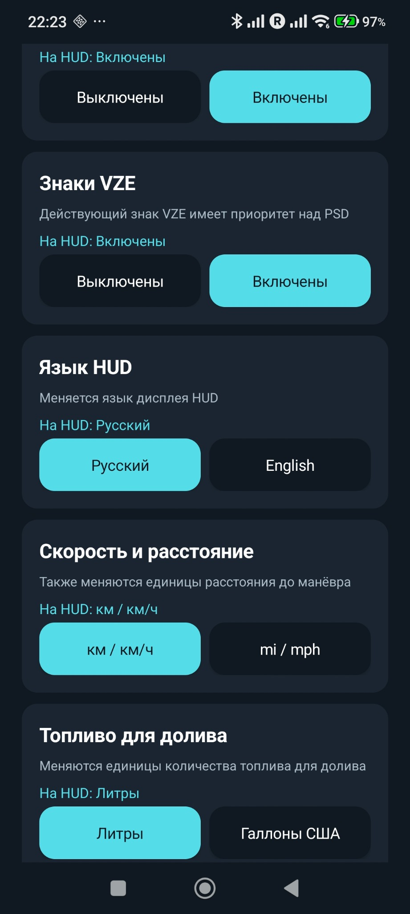
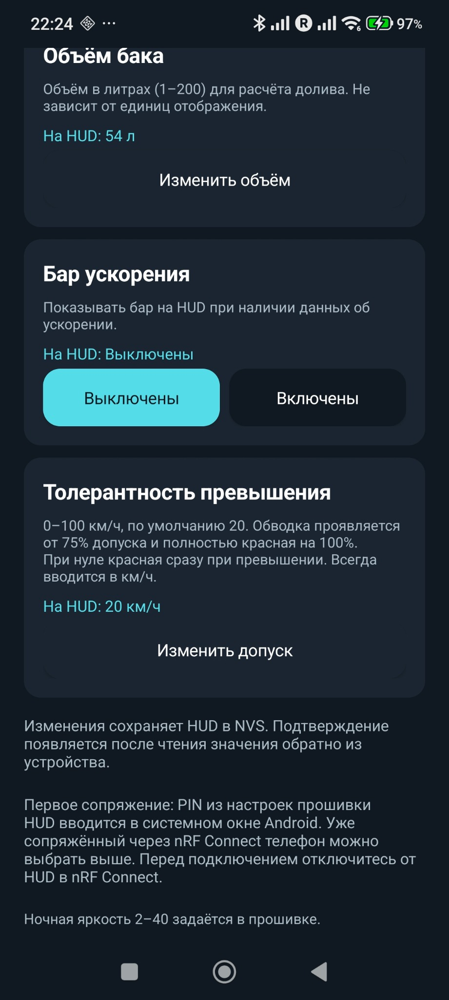
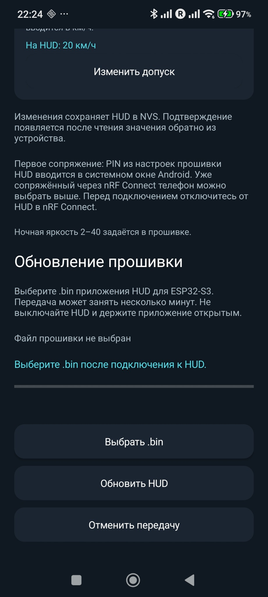

# HUD для Audi A4 B9 (MLB-Evo) — приложение Android

[English](README.md) · [Прошивка SuperMini и схема](https://github.com/WARMW00D/HUD-Audi-A4-B9-MLB-Evo-ESP32-S3-SuperMini-LCD-2.79-NV3007-BLE)

Нативное Android-приложение для проекта Audi HUD от WARMW00D. Меняет настройки HUD и передаёт прошивку по BLE. Версия **1.3** (`versionCode 4`), Android **8.0+**, интерфейс **RU / EN**. Package/application ID: `ru.hud.supermini`.

Проект вырос из [Waveshare HUD](https://github.com/WARMW00D/HUD-Audi-A4-B9-MLB-Evo-Waveshare-ESP32-S3-Touch-LCD-3.49) и адаптации SuperMini. **Приложение использует телефонные GATT-сервисы SuperMini:** настройки v28.1/v28.2 и v29.0; OTA требует v29.0 или совместимую следующую версию. В существующую прошивку Waveshare эти сервисы сначала нужно перенести.

## Объём бака, бар ускорения и толерантность

Версии исходников: **прошивка HUD v29.1 / приложение Android 1.3 (versionCode 4)**.

- **Объём бака:** целое число от **1 до 200 литров**, по умолчанию **54 л**. Всегда вводится в литрах, даже при отображении галлонов США, и меняет расчёт долива на HUD.
- **Бар ускорения:** включается и выключается через приложение. Использует имеющиеся данные ускорения/скорости; на стоянке и без достоверных данных остаётся пустым.
- **Толерантность превышения:** **0–100 км/ч**, по умолчанию **20 км/ч**; всегда вводится в км/ч, даже при отображении mph. Красная обводка проявляется от 75% допуска и полностью красная на 100%; при нуле — сразу при превышении.
- Все три настройки подтверждаются чтением BLE и сохраняются в NVS HUD. Прежние настройки, владелец телефона и ключи шлюза сохраняются. Сброс привязки телефона кнопкой BOOT тоже сохраняет эти значения.

Для новых настроек нужны **приложение 1.3 + прошивка v29.1**. Приложение 1.3 работает и со старой прошивкой: отсутствующие настройки отключены. Готовые APK 1.3 и app-BIN v29.1 от WARMW00D опубликованы в Releases; целостность проверена. Если уже установлена v29.0 с OTA-разделами, v29.1 использует ту же разметку; для более ранних прошивок сначала нужен переход через USB по инструкции ниже.

## Скриншоты приложения

Скриншоты приложения 1.3 от WARMW00D: русский интерфейс.

<table>
  <tr><th>Подключение</th><th>Настройки дисплея</th></tr>
  <tr><td></td><td></td></tr>
  <tr><th>Бак, ускорение, толерантность</th><th>Обновление прошивки</th></tr>
  <tr><td></td><td></td></tr>
</table>

## Скачать прошивку BIN

[Релиз v29.1](https://github.com/WARMW00D/HUD-Audi-A4-B9-MLB-Evo-ESP32-S3-SuperMini-LCD-2.79-NV3007-BLE/releases/tag/v29.1) · [App-BIN](https://github.com/WARMW00D/HUD-Audi-A4-B9-MLB-Evo-ESP32-S3-SuperMini-LCD-2.79-NV3007-BLE/releases/download/v29.1/HUD-SuperMini-v29.1-app.bin) · [SHA-256](https://github.com/WARMW00D/HUD-Audi-A4-B9-MLB-Evo-ESP32-S3-SuperMini-LCD-2.79-NV3007-BLE/releases/download/v29.1/SHA256SUMS.txt).

Образ от WARMW00D, **1 070 448 байт**. Проверены ESP32-S3-заголовок, контрольная сумма и SHA-256. **Только приложение для OTA**: bootloader и таблица разделов не включены. Первая установка — через USB с `partitions.csv` проекта; app-BIN не меняет разметку. Разметка v29.0 с двумя OTA-разделами совместима. Передача OTA на реальном железе здесь ещё не проверена.

## Скачать APK Android

[Версия 1.3](https://github.com/WARMW00D/HUD-Audi-A4-B9-MLB-Evo-Android-App/releases/tag/v1.3) — **Pre-release**, до проверки OTA на реальных устройствах.

- [Release APK](https://github.com/WARMW00D/HUD-Audi-A4-B9-MLB-Evo-Android-App/releases/download/v1.3/HUD-Control-1.3-release.apk) — обычная установка, 59 804 байт.
- [Debug APK](https://github.com/WARMW00D/HUD-Audi-A4-B9-MLB-Evo-Android-App/releases/download/v1.3/HUD-Control-1.3-debug-test-only.apk) — 65 773 байт; `testOnly=true`: `adb install -r -t HUD-Control-1.3-debug-test-only.apk`.
- [SHA-256](https://github.com/WARMW00D/HUD-Audi-A4-B9-MLB-Evo-Android-App/releases/download/v1.3/SHA256SUMS.txt).

Сборки от WARMW00D: версия 1.3 (versionCode 4). Подписи APK v2 и целостность проверены. Ключи совпадают с прежними сборками соответствующего типа: release обновляется поверх release, debug поверх debug. Для смены типа требуется удаление приложения с потерей локальных настроек.

## Возможности

| Функция | Поведение |
|---|---|
| Язык приложения | RU / EN, сохраняется на телефоне; переключение не разрывает BLE |
| Подключение | Первое сканирование; повторное подключение к сохранённому/сопряжённому HUD |
| Язык HUD | RU / EN независимо от языка приложения |
| Единицы | км/ч, км, м либо mph, mi, ft; литры либо галлоны США |
| Знаки | PSD и VZE включаются отдельно |
| Проверка настроек | Запись BLE с ответом, затем чтение; прошивка сохраняет значения в NVS |
| BLE OTA | Системный выбор файла, проверка app-образа, SHA-256, прогресс, отмена |
| Результат OTA | Отдельные проверка/COMMIT; при потере последнего ACK — ожидание перезапуска и проверка |

Приложение само не читает CAN и не передаёт карту телефона на HUD. Навигацию и автомобильные данные декодирует прошивка из I-CAN или BLE-шлюза.

## Сборка

Здесь исходники; готовые APK доступны по ссылкам выше. Закрытые ключи подписи не публикуются.

| Инструмент / параметр | Версия |
|---|---|
| Android Gradle Plugin | 8.7.3 |
| Gradle | 8.9 |
| Java source/target | 17 |
| JDK для Gradle | 17 или 21 |
| compileSdk / targetSdk | 35 / 35 |
| minSdk | 26 |

Установить Android Studio, SDK Platform 35 и запрошенные AGP Build-Tools (34.0.0 в этой конфигурации). В Windows использовать путь без кириллицы во всех родительских папках, например `D:\HUD\android`: иначе AGP может отклонить путь проекта.

В репозитории есть Windows-скрипт: он скачивает официальный Gradle 8.9, проверяет SHA-256 и генерирует Wrapper в отдельном bootstrap-проекте:

```powershell
powershell -ExecutionPolicy Bypass -File .\prepare-and-build.ps1
```

Запускает `:app:assembleDebug` и `:app:lintDebug`. APK: `app/build/outputs/apk/debug/app-debug.apk`. При необходимости передать `-JavaHome` и `-SdkPath`. `-PrepareOnly` только подготовит Wrapper; затем открыть корень проекта в Android Studio.

Linux/macOS: с установленным Gradle 8.9 создать Wrapper (`gradle wrapper --gradle-version 8.9`), локально указать путь Android SDK и выполнить `./gradlew :app:assembleDebug :app:lintDebug`. Сгенерированные файлы Wrapper в этом снимке исходников не приложены.

Для установки поверх предыдущего приложения нужны **тот же applicationId и тот же ключ подписи**. Debug-ключи разных компьютеров могут отличаться. Не публиковать `local.properties`, закрытые ключи и пароли. Release-подпись владелец проекта настраивает отдельно.

## Первое подключение

1. Включить HUD. До привязки он рекламируется как **HUD-SuperMini**.
2. Открыть приложение, разрешить запрошенный Android доступ к Bluetooth и выполнить поиск. На старых Android для BLE-сканирования могут понадобиться разрешение и служба геолокации.
3. Выбрать HUD и завершить системное сопряжение. PIN по умолчанию: `HUD_SETTINGS_PIN` (`supermini_hud/user_config.h`), задаётся прошивкой в `HUD_SETTINGS_PIN`.
4. Первый аутентифицированный телефон становится владельцем. Прочитать настройки и изменить нужные значения.
5. Повторно подключаться через сохранённое/сопряжённое устройство. После привязки HUD использует анонимную non-discoverable рекламу и может не показываться по имени при новом поиске.

После удаления bond на телефоне сбросить владельца на работающем HUD: удерживать **BOOT 5 с и отпустить**. Удалить старое сопряжение Android и привязать заново. Настройки HUD и ключи шлюза сохраняются. Изменение PIN в исходниках само по себе не отзывает прежние ключи.

## Обновление прошивки

Сначала установить v29.0 через USB с её **двумя OTA-разделами**, без Erase All Flash. Приложение не меняет таблицу разделов.

1. Собрать HUD и экспортировать **`supermini_hud.ino.bin`** — только образ приложения.
2. Подключить телефон-владелец. В разделе обновления выбрать `.bin`.
3. Приложение проверит размер и заголовок ESP32-S3, вычислит SHA-256.
4. Подтвердить обновление. Держать приложение открытым и питание стабильным; экран телефона не гаснет во время передачи.
5. После 100% дождаться проверки образа и COMMIT. После перезапуска подключиться снова и проверить HUD.

Максимум: **2 031 616 байт**. Не выбирать bootloader/partitions/merged-образы или дампы. Любая сторонняя программа ESP32-S3 не обязательно совместима с HUD.

Отмена и обрыв до COMMIT удаляют незавершённое обновление; следующая передача начинается заново. Последний ACK может потеряться уже после выбора нового раздела: приложение сообщает неопределённый результат и предлагает дождаться перезапуска и проверить HUD. Автоматический откат неисправной новой программы не гарантируется; восстановление — через USB.

[Инструкция OTA](docs/OTA_ru.md) · [OTA guide](docs/OTA.md)

## BLE-интерфейс

Сервис настроек: `74d0a100-3d92-4f50-9b1a-478142000001`. Каждое значение — один байт; чтение и запись с ответом:

| Суффикс UUID | Настройка | 0 | 1 |
|---|---|---|---|
| `…0002` | PSD | выкл | вкл |
| `…0003` | VZE | выкл | вкл |
| `…0004` | Язык HUD | RU | EN |
| `…0005` | Скорость/дистанция | км | мили |
| `…0006` | Объём | литры | галлоны США |
| `…0007` | Объём бака | 1..200 литров (один беззнаковый байт) | — |
| `…0008` | Бар ускорения | выкл | вкл |
| `…0009` | Толерантность превышения | 0..100 км/ч (один беззнаковый байт) | — |

Сервис OTA: `74d0a200-3d92-4f50-9b1a-478142000001`; control `…0002`, data `…0003`. Согласуется MTU, выполняется одна операция с ответом за раз, после каждого блока читается подтверждённое смещение. Шифрование, аутентифицированное сопряжение и identity владельца проверяет HUD.

`MainActivity.java` — Android BLE, ресурсы и выбор файла; `OtaTransfer.java` — состояния обновления. Используются платформенные Android API без сторонних зависимостей приложения.

## Решение проблем и проверки

| Симптом | Действие |
|---|---|
| Ошибка пути с non-ASCII | Перенести весь проект в путь без кириллицы |
| Несовместимость Gradle 9/10 | Использовать Gradle 8.9 и AGP 8.7.3 проекта |
| HUD не находится по имени после привязки | Подключаться через сохранённые/сопряжённые устройства |
| Настройки работают, OTA отсутствует | Установить v29.0 и новую таблицу через USB |
| Сервисы изменились | Переподключиться; при необходимости переключить Bluetooth Android и перезапустить HUD |
| Не ставится поверх старого APK | Проверить applicationId и ключ подписи |

Пользователь подтвердил работу предыдущей версии приложения настроек. Владелец предоставил подписанные APK v1.3; подписи, целостность, пакет и версия проверены. Здесь APK не пересобирались; результаты lint и проверка OTA на реальном железе ещё требуются. Host-тесты прошивки проверяют протокол и ошибки, но не заменяют Android BLE-тесты. Ключи и форматные параметры RU/EN ресурсов сверены.

## Участники и лицензия

- **WARMW00D (Warmwood):** владелец проекта, интеграция автомобиля/железа и испытания.
- **OpenAI Codex / ChatGPT:** Android BLE-приложение, RU/EN, передача OTA, помощь с интеграцией прошивки и документация.
- **Claude (Anthropic):** помощь, указанная в исходном проекте Waveshare HUD.
- Android / AOSP; NimBLE-Arduino со стороны HUD.

[MIT](LICENSE), исходный copyright Warmwood сохранён. Любительский проект не связан с AUDI AG / Volkswagen AG.
